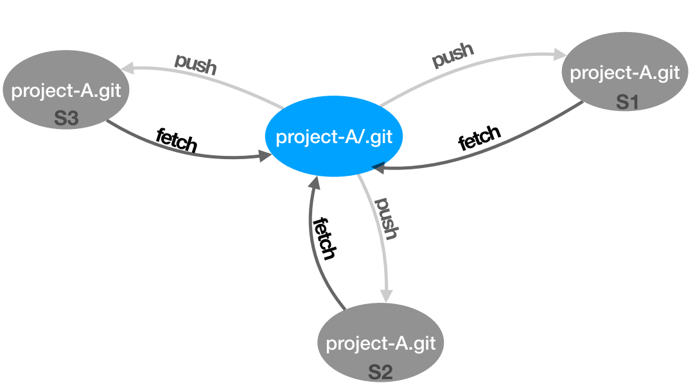
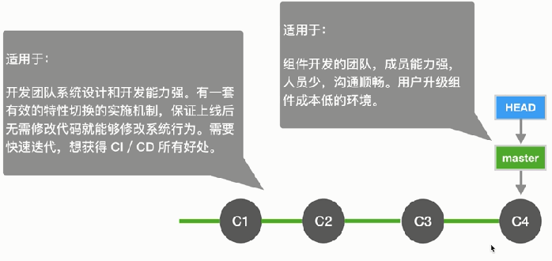
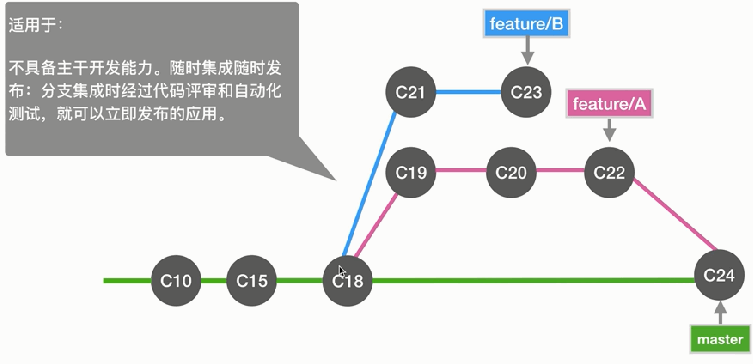

# Git Simple Operation

- [Git Simple Operation](#git-simple-operation)
  - [Introduction](#introduction)
  - [Git flow](#git-flow)
  - [Log](#log)
  - [.git directory](#git-directory)
  - [detached HEAD(分离头指针)](#detached-head%e5%88%86%e7%a6%bb%e5%a4%b4%e6%8c%87%e9%92%88)
  - [meld commits](#meld-commits)
  - [diff](#diff)
  - [reset, checkout](#reset-checkout)
  - [Stash](#stash)
  - [Git Backup](#git-backup)
  - [Github](#github)
  - [Github with Collaborator](#github-with-collaborator)

## Introduction

`git --version`: test installation

**Minimal Config**

```bash
# Set name, email
git config --global user.name "Your Name" # "Your Name"可以与github用户名不同
git config --global user.email "email@example.com"

# find name, email
git config --list

# delete user
git config --local --unset user.name
git config --local --unset user.email
```

local, global, system:

```bash
# local > global > system
git config --local # only for a repo
git config --global # for all repos of current user(recommended)
git config --system # 对系统所有登录的用户有效
```

```bash
# list config
git config --list --local
git config --list --global
git config --list --system

# all config
git config --list
```

**Git New repo**

Empty Directory: 

```bash
git init project_name
cd project_name
```

Not Empty Directory:

```bash
cd project_name
git init
```

## Git flow


```bash
# check status
git status

# 1.new file

# 2. add to staged
git add file1.txt
git add dir1
git add * # add all
git add -u # add all modified files
git add -A # add new files

git rm --cached file1.txt file2.txt # move files from stagged area to working dir

# 3. commit
git commit -m "add files"

# 4. push
git push origin master
```

Rename Trick:

```bash
# without trick
mv filename1 filename2
git status
git rm filename1
git add filename2
git status

# 从git区到stagged区，再到工作区
git reset --hard

# rename trick
git mv filename1 filename2
```

Delete Trick:

```bash
# without trick
rm file1
git status
git rm file1
git status

git reset --hard

# delete trick
git rm file1
git status
```

## Log

```bash
git log --oneline # show log in one line
git log -n2 --oneline # recent 2 log in oneline
```

```bash
# see branch
git branch -v

# 1.new branch
git checkout -b temp 60603745e47

# 2. modify file, add, commit

# 3. see branch
git branch -v
#   master 91d3a5f modify file2
# * temp   4431e98 modify file3

# 4. log
git log # see current branch log
git log --all # see all branchs log
git log --all --oneline --graph # show all in graph
git log --all --oneline -n4 # show 4 log in graph
```

GUI log: `gitk`
> 直接在vscode termianl中`gitk`  
> 

## .git directory

```bash
.git/
    HEAD # pointer
    config # some --local config
    refs/
        heads/
            master
            branch1
            branch2
            ...
        tags/
            v1.0
            v1.1
            ...
    objects/
        d8/
        9c/
        ...
```

`git checkout master`: Switch branch

```bash
cat HEAD
# ref: refs/heads/master
# git checkout master本质是修改HEAD文件

cat config
# ...
# git config --local user.name='your_name'本质是修改config文件

cat refs/heads/master
# ...
```

`git cat-file`: 命令显示版本库对象的内容、类型及大小信息。

git对象类型:
- tree
- commit
- blob
- tag
- ...

```bash
git cat-file -t # 显示对象的类型
git cat-file -p # 显示对象的内容
```

```bash
# example

git branch -v
#   master 91d3a5f modify file2
# * temp   4431e98 modify file3

cd .git/refs/heads
cat master
# 91d3a5f76ed3274df6f2073eaa018cc2fb226e94

git cat-file -t 91d3a5f76ed
# commit

git cat-file -p 91d3a5f76ed
# tree bae57d5506e910894382e78a7aa1c67072c97518
# parent 60603745e476254d02d91d383ef4d74904a12f9a
# author HPGrey <grey@pku.edu.cn> 1565435948 +0800
# committer HPGrey <grey@pku.edu.cn> 1565435948 +0800

# modify file2
```

```bash
# example

cd .git/objects/d8
ls
# 8c464a96a5c64a07b18b798cbbba2ed2a60d51
git cat-file -t d88c464a96a
# blob

cd .git/objects/9c
ls
# a0c4d55c3c094626c78786340d3d1f8a13d44f
git cat-file -t 9ca0c4d55c3c09462
# tree
```

**git核心对象**: commit, tree, blob
> 

- 一个commit相当于一个快照
- 一个commit对应一个tree
- 一个directory对应一个tree
- blob的hash值相同就是同一个文件

```bash
# example
git log --oneline
# 4431e98 (HEAD -> temp) modify file3
# 6060374 (tag: interesting1) rename file
# e159ce0 add 3 file

git cat-file -t 6060374
# commit

git cat-file -p 6060374
# tree 979c0bed4d7fd86f7d03b8c1b70be8148f32723f
# parent e159ce04f97055268f275fe75f172926cd9ac177
# author HPGrey <grey@pku.edu.cn> 1565435676 +0800
# committer HPGrey <grey@pku.edu.cn> 1565435676 +0800
# rename file

git cat-file -p 979c0bed4d7fd86f7d03b8c1b70be8148f32723f
# 100644 blob d88c464a96a5c64a07b18b798cbbba2ed2a60d51    file11.txt
# 100644 blob d9a0c4d55c3c094626c78786340d3d1f8a13d44f    file2.txt
# 100644 blob 968200480e69a05b4d85b9e7143d864bc9c7435b    file3.txt
```

## detached HEAD(分离头指针)

detached HEAD: 本质是没有在branch上面工作，但可以add, commit，但如果再切换到branch，之前的工作就消失了；所以detached HEAD应用到
- detached HEAD需要和某个branch挂钩，进而保存工作
- detached HEAD用来做实验，做完了扔掉

```bash
# example
git branch -v
# * master 91d3a5f modify file2
#   temp   4431e98 modify file3

git log --oneline
# 91d3a5f (HEAD -> master) modify file2
# 6060374 (tag: interesting1) rename file
# e159ce0 add 3 file

git checkout 6060374
# Note: checking out '6060374'.

# You are in 'detached HEAD' state. You can look around, make experimental
# changes and commit them, and you can discard any commits you make in this
# state without impacting any branches by performing another checkout.

# If you want to create a new branch to retain commits you create, you may
# do so (now or later) by using -b with the checkout command again. Example:

#   git checkout -b <new-branch-name>

# HEAD is now at 6060374 rename file

git branch -v
# * (HEAD detached at 6060374) 6060374 rename file
#   master                     91d3a5f modify file2
#   temp                       4431e98 modify file3

# # modify file

git checkout master
# Warning: you are leaving 1 commit behind, not connected to
# any of your branches:
#   5b180c7 addline to file3
# If you want to keep it by creating a new branch, this may be a good time
# to do so with:
#  git branch <new-branch-name> 5b180c7
# Switched to branch 'master'

git branch dbranch 5b180c7

git branch -v
#   dbranch 5b180c7 addline to file3
# * master  91d3a5f modify file2
#   temp    4431e98 modify file3
```

`git checkout -b new1 temp`: new branch `new1` based on branch `temp`

```bash
# example
git checkout -b new1 temp

git log --oneline # HEAD既指new1, 也指向temp
# 4431e98 (HEAD -> new1, temp) modify file3
# 6060374 (tag: interesting1) rename file
# e159ce0 add 3 file

gitk --all

# compare two commit
git diff 4431e98 6060374
git diff HEAD 6060374

git diff HEAD HEAD^1 # compare HEAD with its father
git diff HEAD HEAD^ # compare HEAD with its father
git diff HEAD HEAD~1 # compare HEAD with its father

git diff HEAD HEAD^1^1 # compare HEAD with its grandfather
git diff HEAD HEAD^^ # compare HEAD with its grandfather
git diff HEAD HEAD~2 # compare HEAD with its grandfather
```

- `git branch -d new1`: delete branch with warning;
- `git branch -D new1`: delete branch without warning;

`git commit --amend`: 对最近一次commit的message进行变更

```bash
# 对历史commit的message进行变更
git log --oneline
# ae2dbeb (HEAD -> master) modify file2, hello
# b8d6373 rename file
# e159ce0 add 3 file

git rebase -i e159ce0
# [detached HEAD e5190ab] rename file,world
#  Date: Sat Aug 10 19:14:36 2019 +0800
#  1 file changed, 0 insertions(+), 0 deletions(-)
#  rename file1.txt => file11.txt (100%)
# Successfully rebased and updated refs/heads/master.

# # in vim: modify command
reword 6060374 rename file
pick 7ef2138 modify file2, hello

# # in vim: modify message
rename file, world

git log --oneline
# b19ae62 (HEAD -> master) modify file2, hello
# e5190ab rename file,world
# e159ce0 add 3 file
```

> rebase是一般用于自己的branch(还没有贡献到集成的分支上)，已经贡献到集成分支上的不要使用rebase，会影响其他人工作

## meld commits

meld continuous commits(合并历史上连续的commits)

```bash
git log --oneline
# c2372b4 (HEAD -> master) modify file1
# 6607010 add 3 lines
# 5960835 add lines
# 0ff6223 add words
# b19ae62 modify file2, hello
# e5190ab rename file,world
# e159ce0 add 3 file

git rebase -i b19ae62
# [detached HEAD 70b86bd] add something to file1
#  Date: Sat Aug 10 22:42:00 2019 +0800
#  1 file changed, 10 insertions(+)
#  create mode 100644 file1.txt
# Successfully rebased and updated refs/heads/master.

# # in vim: modify command
pick 0ff6223 add words
s 5960835 add lines
s 6607010 add 3 lines
s c2372b4 modify file1

## in vim: modify commit message
...

git log --oneline
# 70b86bd (HEAD -> master) add something to file1
# b19ae62 modify file2, hello
# e5190ab rename file,world
# e159ce0 add 3 file
```

meld discontinuous commits(合并历史上不连续的commits)

```bash
git log --oneline
# 70b86bd (HEAD -> master) add something to file1
# b19ae62 modify file2, hello
# e5190ab rename file,world
# e159ce0 add 3 file

git rebase -i e159ce0

# in vim: modify commit commana，合并root commit 和不连续的另一个
pick e159ce0
s b19ae62
pick e5190ab
pick 70b86bd

git status
git rebase --continue
```

> 如果合并 根commit, 那么`gitk --all`上有两个commit没有Parent节点，最新的那个节点之前的commits都可以丢弃掉

## diff

`git diff --cached`: 比较stagged和HEAD

`git diff`: 比较工作区与stagged所有的difference

`git diff -- readme.md`: 比较工作区与stagged中readme.md文件的difference

- `git diff master temp -- file3.txt`: compare a file in two branches
- `git diff master temp -- file3.txt`: compare all files in two branches

example: compare file in 2 commits

```bash
git log --oneline --graph --all
# * ac222b7 (HEAD -> temp) mofidy file3
# | * 10ede7d (master) fix file3
# | * 29523ea fix file2
# |/
# * e1b1187 add txts
# * 9d4847d add style

git diff 10ede7d ac222b7 -- file3.txt
```

## reset, checkout

- `git reset HEAD`: unstagged all, 从HEAD到stagged
- `git reset HEAD -- <file>`: unstagged a file, 暂存区<file>变成HEAD内容
- `git reset --hard`: 从HEAD到stagged, 再到工作区

git reset --soft HEAD~
> undo last commit  
> 

git reset --hard
> 

git reset --mixed(defaulted)
> 

```bash
git reset HEAD
git diff --cached # empty result
```

- `git checkout -- <file>`: discard changes, 工作区变成暂存区内容
- `git reset --hard`: 从HEAD到stagged, 再到工作区, 相当于discard all changes

```bash
git checkout -- readme.md
git diff # empty result
```

example: drop recent 2 commits

```bash
git log --oneline
# cb70918 (HEAD -> master) fix file2, file3
# 2c7a7ba add line3 for file3Signed-off-by: Grey <grey@pku.edu.cn>
# 10ede7d fix file3
# 29523ea fix file2
# e1b1187 add txts
# 9d4847d add style

gitk --all

git reset --hard 10ede7d
# HEAD is now at 10ede7d fix file3

gitk --all

git log --oneline
# 10ede7d (HEAD -> master) fix file3
# 29523ea fix file2
# e1b1187 add txts
# 9d4847d add style
```

## Stash

暂时将工作区存到stash，方便以后使用

- `git stash`: stash working dir
- `git stash save "some msg"`: stash working dir with msg
- `git stash list`
- `git stash show`
- `git stash show -p`: show stash with content
- `git stash apply`: apply recent one, recent one still in stash
- `git stash pop`: pop recent one, recent one not in stash anymore
- `git stash drop`: drop recent one
- `git stash clear`: clear all stashes

> Trick: [.gitignore templates](https://github.com/github/gitignore)

## Git Backup

> 

常用协议|语法格式|说明
---|---|---
本地协议1|/path/to/repo.git|哑协议
本地协议2|file:///path/to/repo.git|智能协议
http/https|https://github.com/GreyRaphael/PlayGit.git|平时接触到的都是智能协议
ssh|git@github.com:GreyRaphael/PlayGit.git|工作中用的智能协议

> 直观区别：哑协议传输进度不不可⻅见；智能协议传输可⻅见。  
> 传输速度：智能协议⽐比哑协议传输速度快。

```bash
# --bare: 不带code,只有.git
git clone --bare C:\Users\Administrator\Downloads\myprojcet\.git ya.git
git clone --bare file://C:\Users\Administrator\Downloads\myprojcet\.git zhineng.git

# 带code
git clone file://C:\Users\Administrator\Downloads\myprojcet\.git zhineng.git
```

example: backup in one machine

```bash
# 1. clone bare repo
C:\Users\Administrator\Downloads>git clone --bare file://C:\Users\Administrator\Downloads\myprojcet\.git zhineng.git

cd myproject

git remote -v
# empty result

# 2. add remote
git remote add zhineng file://C:\Users\Administrator\Downloads\zhineng.git

# 3. add branch, modify file....
git branch -av

# 4. push & follow info
git push zhineng

# 5. check branch
git branch -av
# * gewei                  10ede7d fix file3
#   master                 10ede7d fix file3
#   temp                   ac222b7 mofidy file3
#   remotes/zhineng/gewei  10ede7d fix file3
#   remotes/zhineng/master 10ede7d fix file3
#   remotes/zhineng/temp   ac222b7 mofidy file3

# 6. remove remote
git remote remove zhineng
```

## Github

[Github Features](https://github.com/features)
> github的CI是3rd提供的  
> gitlab本身具有CI

Github Trick:
- [Advanced Search](https://github.com/search/advanced?) Repos: created:<2019-01-01
- search readme: `ipv6 hosts google in:readme filename:hosts`
- search readme: `ipv6 hosts in:readme stars:>1000`
- search blog: `github blog in:readme stars:>2000`

**Github blog**

Github Advanced Search: `github blog in:readme`
> [jekyll](https://github.com/barryclark/jekyll-now)

example: sync with github

```bash
git remote add github git@github.com:GreyRaphael/test.git
git remote -v
# github  git@github.com:GreyRaphael/test.git (fetch)
# github  git@github.com:GreyRaphael/test.git (push)
# zhineng file://C:\Users\Administrator\Downloads\zhineng.git (fetch)
# zhineng file://C:\Users\Administrator\Downloads\zhineng.git (push)

# push all branches to remote
git push github --all
# To github.com:GreyRaphael/test.git
#  * [new branch]      gewei -> gewei
#  * [new branch]      temp -> temp
#  ! [rejected]        master -> master (fetch first)
# error: failed to push some refs to 'git@github.com:GreyRaphael/test.git'

# pull: 先fetch再merge; 保险起见fetch
git fetch github master
# From github.com:GreyRaphael/test
#  * branch            master     -> FETCH_HEAD
#  * [new branch]      master     -> github/master

# fetch会将remote的tree拿下来，但trees并没有连接
gitk --all
```

non fast-forward: master与remote/github/master没有共同的祖先; 所以non fast-forward再push回报错;

method1: merge

```bash
# method1: merge
git checkout master
git merge github/master # 因为master没有父子关系，会报错
# fatal: refusing to merge unrelated histories
git merge --allow-unrelated-histories github/master # ok
gitk --all # merge之后的HEAD有两个Parent节点
git push github master
```

method2: rebase
> 以remote/github/master作为基础，`rebase -i`, 然后pick, squish, squish来形成一个新的tree, 代价就是更改了以前commits的hash值

## Github with Collaborator

Method1: repo/Settings/Collaborators(recommended)
> all collaborators should have Github account

Method2: 

**Github Organization**

Organization包含repos, Organization中有People(Github user), 权限控制采用Team
> 对比Gitlab, People中的所有人都可以看到其他人的权限，方便申请

[ExampleOrganization](https://github.com/pku-ion-beam)

**Development Flow**

Trunk Based Development
> Java开发挺适用的  
> 

Git Flow
> 适用于：不具备主干开发能力。有预定的发布周期。需要执行严格的发布流程。研发周期长。  
> 

Github Flow
> 

Production branch with GitLab flow
> 适用于：不具备主干开发能力。无法控制准确的发布时间，但又要求不停的集成。  
> 

Environment branches with GitLab flow
> 适用于：不具备主干开发能力。需要逐个通过各个测试环境的验证才能发布  
> 

Release branches with GitLab flow
> 适用于：不具备主干开发能力。需要对外发布和维护不同版本(比如不同驱动的不同版本都可以用，那么就要维护多个版本)。  
> 

简单的一般采用Github多个特性分支开发的方式