# Github

- [Github](#github)
  - [Introduction](#introduction)
  - [Sync local repo with github repo](#sync-local-repo-with-github-repo)
  - [Github with Collaborator](#github-with-collaborator)
  - [Github Organization](#github-organization)
  - [Development Flow](#development-flow)
  - [Github pull Request](#github-pull-request)
  - [Github Code Review](#github-code-review)

## Introduction

[Github Features](https://github.com/features)
> github的CI是3rd [Market](https://github.com/marketplace)提供的  
> gitlab本身具有CI

Github Search Repos Trick:
- [Advanced Search](https://github.com/search/advanced?) Repos: `created:<2019-01-01`
- search readme: `ipv6 hosts google in:readme filename:hosts stars:>1000`
- search blog: `github blog in:readme stars:>2000`
  > [Github Blog Template jekyll](https://github.com/barryclark/jekyll-now)

## Sync local repo with github repo

目的: 将本地非空的repo与远程非空repo同步
1. 本地id_rsa.pub与Github Settings中ssh-key相同，本地repo与远程repo作者相同(email相同)
2. 本地id_rsa.pub与Github Settings中ssh-key相同，本地repo与远程repo作者不同(通过`git config --local user.email`实现)
3. 本地id_rsa.pub与Github Settings中ssh-key不同，本地repo与远程repo作者不同，远程repo中的Settings/Collaborators中要添加本地id_rsa.pub对应的github账户

easy merge by `pull`:

```bash
git remote add github git@github.com:GreyRaphael/test.git
# pull: fetch & merge
git pull github master --allow-unrelated-histories
# see structure
gitk --all
# push other branches to remote
git push github --all
gitk --all
````

Details merge by `fetch` and `merge`

```bash
git remote add github git@github.com:GreyRaphael/test.git
git remote -v
# github  git@github.com:GreyRaphael/test.git (fetch)
# github  git@github.com:GreyRaphael/test.git (push)

# push all branches to remote
git push github --all
# To github.com:GreyRaphael/test.git
#  * [new branch]      gewei -> gewei
#  * [new branch]      temp -> temp
#  ! [rejected]        master -> master (fetch first)
# error: failed to push some refs to 'git@github.com:GreyRaphael/test.git'

# pull: 先fetch再merge; 保险起见fetch
git fetch github master
# From github.com:GreyRaphael/test
#  * branch            master     -> FETCH_HEAD
#  * [new branch]      master     -> github/master

# fetch会将remote的tree拿下来，但trees并没有连接
gitk --all
```

non fast-forward: master与remote/github/master没有共同的祖先; 所以non fast-forward再push回报错;

method1: merge

```bash
git checkout master
git merge github/master # 因为master没有父子关系，会报错
# fatal: refusing to merge unrelated histories
git merge --allow-unrelated-histories github/master # ok
gitk --all # merge之后的HEAD有两个Parent节点
git push github master
```

method2: rebase
> 以remote/github/master作为基础，`rebase -i`, 然后pick, squish, squish来形成一个新的tree, 代价就是更改了以前commits的hash值

## Github with Collaborator

**用户协作情形**:
1. 两个用户修改不同repo中的不同文件
1. 两个用户修改不同repo中的同一文件，不同区域
1. 两个用户修改不同repo中的同一文件，同一区域
1. 一个用户变更文件名，一个用户变更文件内容
1. 两个用户都修改文件名

**1. 两个用户修改不同repo中的不同文件**

```bash
# 1. github创建一个repo, 添加file1, file2; Settings添加Collaborator
# 2. owner和collaborator都clone到本地

# 3. collaborator修改file2, not push
git remote -v
# origin  git@github.com:BetaGrey/test.git (fetch)
# origin  git@github.com:BetaGrey/test.git (push)

git branch -av
# * master                ab25d36 Beta add 2 files
#   remotes/origin/HEAD   -> origin/master
#   remotes/origin/master ab25d36 Beta add 2 files

# # modify file2
vi file2
git add *
git commit -m"collaborator fix file2"
```

```bash
# 4. owner修改file1, push
vi file1
git add *
git commit -m"owner fix file1"
git push
```

```bash
# 5. collaborator push
git push
# To github.com:BetaGrey/test.git
#  ! [rejected]        master -> master (non-fast-forward)
# error: failed to push some refs to 'git@github.com:BetaGrey/test.git'
# hint: Updates were rejected because the tip of your current branch is behind
# hint: its remote counterpart. Integrate the remote changes (e.g.
# hint: 'git pull ...') before pushing again.
# hint: See the 'Note about fast-forwards' in 'git push --help' for details.

# 为了细节用fetch & merge, 一般都是用pull
git fetch origin

git branch -av
# * master                537df80 [ahead 1, behind 1] collaborator fix file2
#   remotes/origin/HEAD   -> origin/master
#   remotes/origin/master a94c8bf owner fix file1

git merge origin/master
# Merge made by the 'recursive' strategy.
#  file1 | 4 +++-
#  1 file changed, 3 insertions(+), 1 deletion(-)

git push origin
```

```bash
# 6. owner pull
git pull
gitk --all
```
> 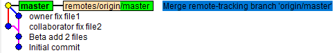

**2. 两个用户修改不同repo中的同一文件，不同区域**

```bash
# 1.owner在上面repo例子的基础上添加file3, 并push
# 2. owner然后修改file3前半段
vi file3
git add *
git commit -m "owner add front code"
```

```bash
# 3. collaborator修改file3后半段，并push
git pull
vi file3
git add *
git commit -m "colloaborator add bottome code"
git push
```

```bash
# 4. owner push
git push
# To github.com:BetaGrey/test.git
#  ! [rejected]        master -> master (fetch first)
# error: failed to push some refs to 'git@github.com:BetaGrey/test.git'
# hint: Updates were rejected because the remote contains work that you do
# hint: not have locally. This is usually caused by another repository pushing
# hint: to the same ref. You may want to first integrate the remote changes
# hint: (e.g., 'git pull ...') before pushing again.
# hint: See the 'Note about fast-forwards' in 'git push --help' for details.

# 简便方式
git pull
git push
```

```bash
# 5. collaborator pull
git pull
gitk --all
```
> 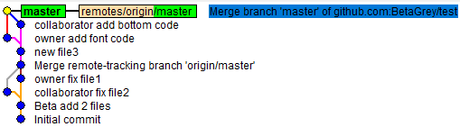

**3. 两个用户修改不同repo中的同一文件，同一区域**

```bash
# 1. owner在上面repo例子的基础上添加file4, 并push
# 2. owner修改某一位置
vi file4
git add *
git commit -m "owner add code in file4"
```

```bash
# 3. collaborator修改file4同一位置
git pull
vi file4
git add *
git commit -m "collaborator add code in file4"
git push
```

```bash
# 4. owner push
git push
# To github.com:BetaGrey/test.git
#  ! [rejected]        master -> master (fetch first)
# error: failed to push some refs to 'git@github.com:BetaGrey/test.git'
# hint: Updates were rejected because the remote contains work that you do
# hint: not have locally. This is usually caused by another repository pushing
# hint: to the same ref. You may want to first integrate the remote changes
# hint: (e.g., 'git pull ...') before pushing again.
# hint: See the 'Note about fast-forwards' in 'git push --help' for details.

git pull # 这种conflict，需要人工协调然后手动解决(vscode自动跳到conflict位置)
# From github.com:BetaGrey/test
#    223858a..27c6e18  master     -> origin/master
# Auto-merging file4
# CONFLICT (content): Merge conflict in file4
# Automatic merge failed; fix conflicts and then commit the result.

# 文本解决conflict之后: 比如两个修改都保存
git status
# You have unmerged paths.
#   (fix conflicts and run "git commit")
#   (use "git merge --abort" to abort the merge)

# Unmerged paths:
#   (use "git add <file>..." to mark resolution)

#         both modified:   file4

# no changes added to commit (use "git add" and/or "git commit -a")

# add to staged & commit
git commit -am "resolved conflict by owner & collaborator"
git push
```

```bash
# 5. collaborator
git pull
gitk --all
```
> 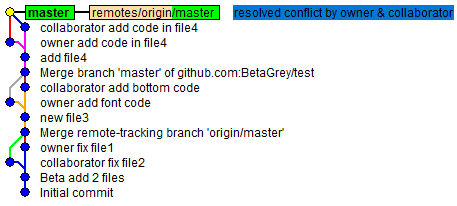

**4. 一个用户变更文件名，一个用户变更文件内容**

```bash
# 1. owner在上面repo例子的基础上添加file5, 并push
# 2. owner rename file5 to file55
git mv file5 file55
git commit -m "owner rename file5"
```

```bash
# 3. Collaborator修改file5文件内容
git pull
vi file5
git add *
git commit -m "collaborator add lines"
git push
```

```bash
# 4. owner push
git push
# To github.com:BetaGrey/test.git
#  ! [rejected]        master -> master (fetch first)
# error: failed to push some refs to 'git@github.com:BetaGrey/test.git'
# hint: Updates were rejected because the remote contains work that you do
# hint: not have locally. This is usually caused by another repository pushing
# hint: to the same ref. You may want to first integrate the remote changes
# hint: (e.g., 'git pull ...') before pushing again.
# hint: See the 'Note about fast-forwards' in 'git push --help' for details.

git pull
# From github.com:BetaGrey/test
#    b8b35ad..7485381  master     -> origin/master
# Merge made by the 'recursive' strategy.
#  file55 | 7 ++++++-
#  1 file changed, 6 insertions(+), 1 deletion(-)

git push
```

```bash
# 5.Collaborator pull
git pull
gitk --all
```
> 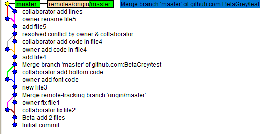

**5. 两个用户都修改文件名**

```bash
# 1. owner在上面repo例子的基础上添加file6, 并push
# 2. owner rename file6 to file60
git mv file6 file60
git commit -m "owner rename file6"
```

```bash
# 3. Collaborator rename file6 to file 69
git pull
git mv file6 file69
git commit -m "collaborator rename file6"
git push
```

```bash
# 4. owner push
git push
# not fast-forwards

git pull
# From github.com:BetaGrey/test
#    6a96ecb..050f59b  master     -> origin/master
# CONFLICT (rename/rename): Rename "file6"->"file60" in branch "HEAD" rename "file6"->"file69" in "050f59b8cf5b72ddab5098f0db0c432f8453c517"
# Automatic merge failed; fix conflicts and then commit the result.

ls # file60, file69同时存在
git status
# Unmerged paths:
#   (use "git add/rm <file>..." as appropriate to mark resolution)
#         both deleted:    file6
#         added by us:     file60
#         added by them:   file69
# no changes added to commit (use "git add" and/or "git commit -a")

git rm file6 file60
git add file69
git git commit -am "resolve rename conflict to file69"
git push
```

```bash
# 5.Collaborator pull
git pull
gitk --all
```
> 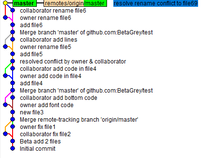

## Github Organization

Organization包含repos, Organization中有People(Github user), 权限控制采用Team
> 对比Gitlab, People中的所有人都可以看到其他人的权限，方便申请

[ExampleOrganization](https://github.com/pku-ion-beam)

## Development Flow

Trunk Based Development
> Java开发挺适用的  
> 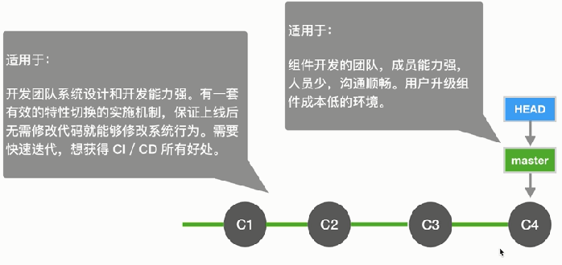

Git Flow
> 适用于：不具备主干开发能力。有预定的发布周期。需要执行严格的发布流程。研发周期长。  
> 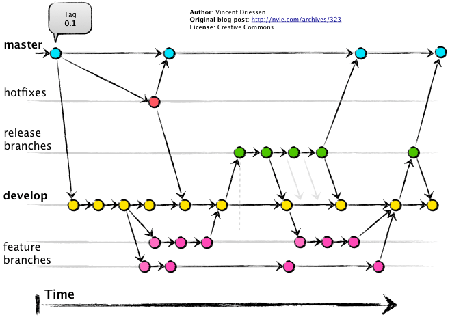

Github Flow
> 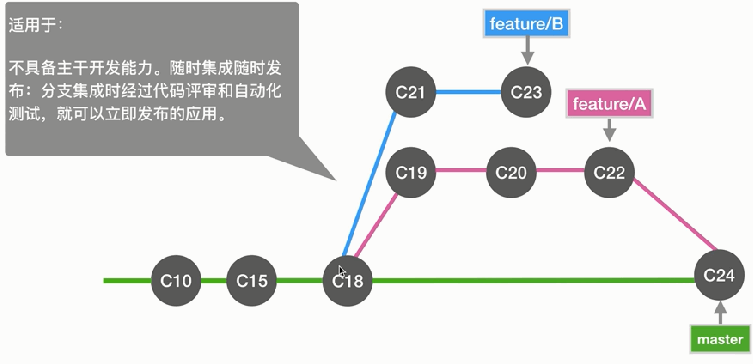

Production branch with GitLab flow
> 适用于：不具备主干开发能力。无法控制准确的发布时间，但又要求不停的集成。  
> 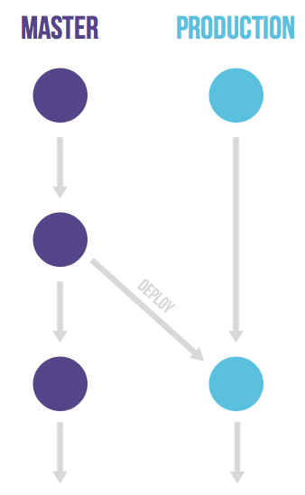

Environment branches with GitLab flow
> 适用于：不具备主干开发能力。需要逐个通过各个测试环境的验证才能发布  
> 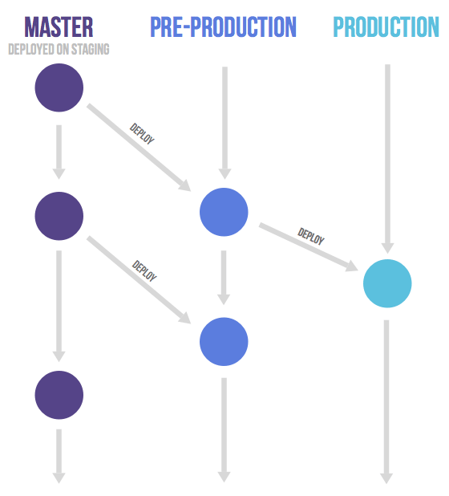

Release branches with GitLab flow
> 适用于：不具备主干开发能力。需要对外发布和维护不同版本(比如不同驱动的不同版本都可以用，那么就要维护多个版本)。  
> 

简单的一般采用Github多个特性分支开发的方式

## Github pull Request

本质: 通过pull requests将一个分支合并到另一个分支
> 

Github有三种合并分支的方式，通过Repo/Settings/Options/Merge Button来配置，默认三种都支持

Pull-Requests流程: Repo/Pull requests/New pull request/Choose Branch/Create pull request/，然后选择三种方式其一:
> 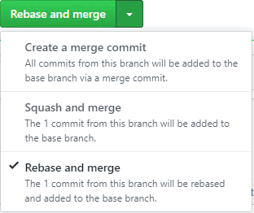

Example: 演示三种merge方式
> 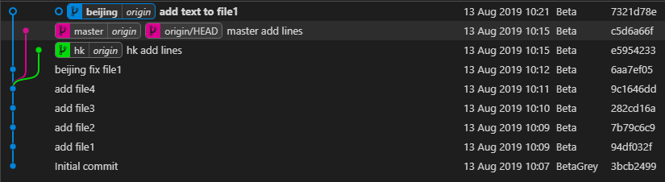

通过`git push origin master -f`返回未merge的状态，因为本地的master为未合并状态

**Create a merge commit**
> 新节点commit有两个parent  
> 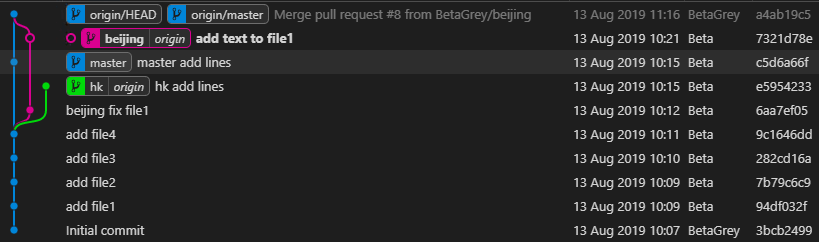

**Squash and merge**
> beijing分支的commits合并成一个，并rebase到master分支上  
> 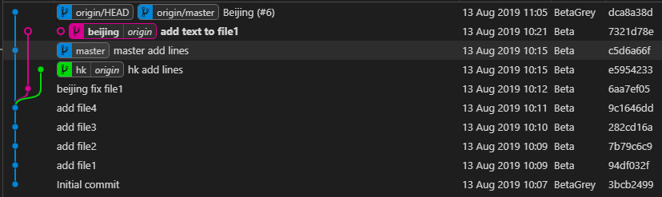

**Rebase and merge**
> beijing分支的commits挨个rebase到master分支上  
> 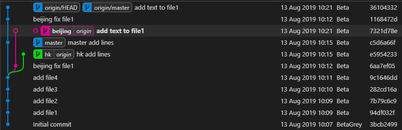

## Github Code Review

Repo/Settings/Branches/Branch protection rules/Add rule/
